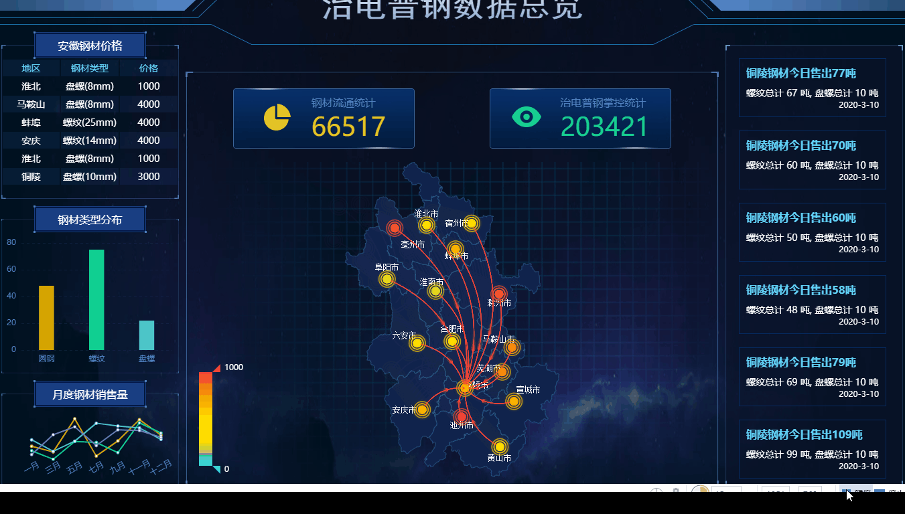
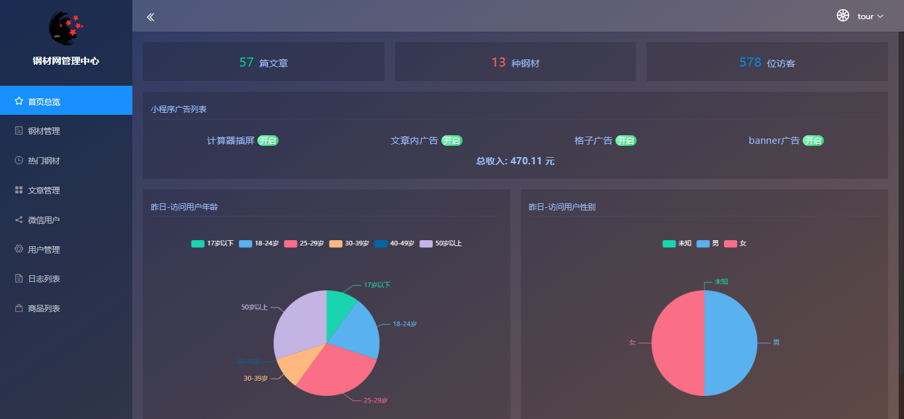
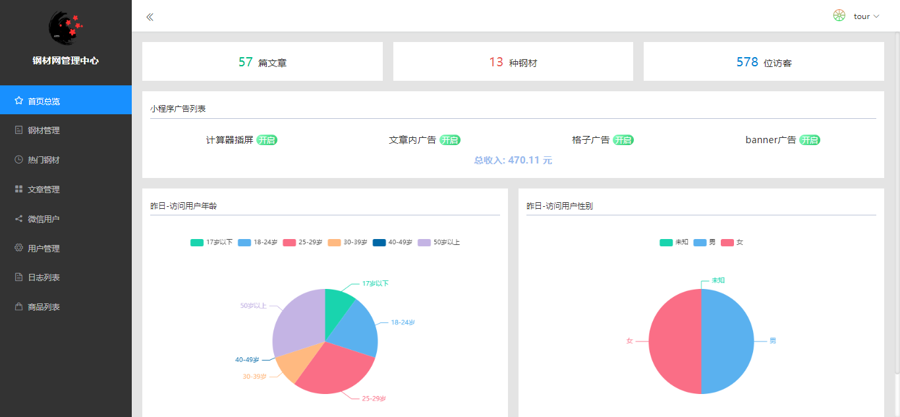
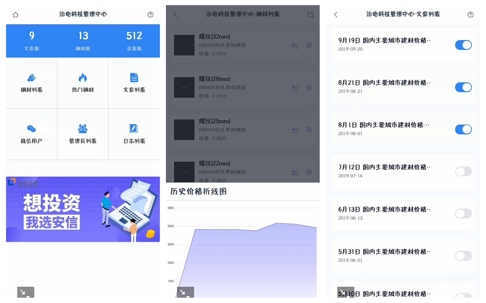
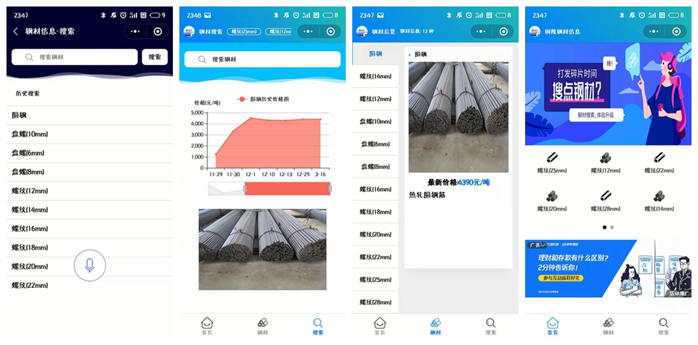

# 铜陵钢材信息小程序整体系统

### 投资理财, 我选[安信证券](https://sjkh.essence.com.cn/h5kh/openAccountApli.html?bank=0&sceneid=1&branch=8910&org=1&tgid=494303&pt=crm#)

## 项目出现原因
铜陵已是资源枯竭型城市, 在这互联网寒冬, 我们钢材厂继续跟上工业互联网的发展, 用工业互联网点燃寒冬下的火柴, 让火柴点燃我们的激情, 让激情温暖寒冬
 
## 项目时间线
 
 - 2018.07 见面, 了解需求
 - 2018.08 后端技术选型(EggJS, MySQL)
 - 2018.09 管理后台前端技术选型(Vue, ElementUI)
 - 2018.10 需求整理完成, 小程序技术选型(UniApp)
 - 2018.10 - 2019.03 开发, 上线, 迭代
 - 2019.06 管理后台添加权限
 - 2019.07 小程序登录位置调整, 广告位添加
 - 2019.09 管理后台手机端
 - 2019.10 小程序钢材搜索添加语音识别
 - 2019.10 后端添加数据库初始化, 创建初始管理员相关脚本
 - 2019.11 后端添加钢材价格爬虫定时任务
 - 2019.12 小程序图表改为ucharts
 - 2020.01 后端添加钢材价格汇总文章定时发布任务
 - 2020.01 小程序添加钢材重量计算器
 - 2020.03 高层视察数据大屏
 - 2020.04 支付宝支付流程
 - 2020.04 小程序搜索添加敏感词判断
 - 2020.07 小程序扫码登录

## 项目目录

 - [ApiServer         API服务端](https://github.com/klren0312/ironInfoWeapp/tree/master/ApiServer)
 - [ServerWeb         WEB管理后台PC端](https://github.com/klren0312/ironInfoWeapp/tree/master/ServerWeb)
 - [ServerWebMobile   WEB管理后台手机端](https://github.com/klren0312/ironInfoWeapp/tree/master/ServerWebMobile)
 - [Weapp             小程序与H5端](https://github.com/klren0312/ironInfoWeapp/tree/master/Weapp)
 - [bigScreen         视察用数据大屏](https://github.com/klren0312/ironInfoWeapp/tree/master/bigScreen)
 - [相关文档](https://github.com/klren0312/ironInfoWeapp/tree/master/doc)

## 开源计划

* [x] API服务端
* [x] 管理后台PC端
* [x] 管理后台手机端
* [x] 小程序与H5
* [x] 文档: 需求文档 
* [x] 文档: API文档 
* [x] 文档: 开发文档 
* [x] 文档: 程序对应文档

## 小程序码

# 高层视察数据大屏
> https://klren0312.github.io/ironInfoWeapp/

# 管理后台
>[http://admin.zzes1314.cn](http://admin.zzes1314.cn)
(**用户名**: `tour`,  **密码**: `tour520`)

# 管理后台手机端

## 界面截图
 - 第七版, 钢材计算器, 图表样式修改, 底部tabbar图标修改
---

 - 第六版, UI错误修改, 钢材搜索添加语音识别, 删除影响渲染的广告位
---

 - 第五版, UI调整
---

 - 第四版, UI调整
---

 - 第三版,添加首页
---

 - 第二版, 修改样式和添加联想搜索
---

 - 第一版
---

## Stargazers over time

