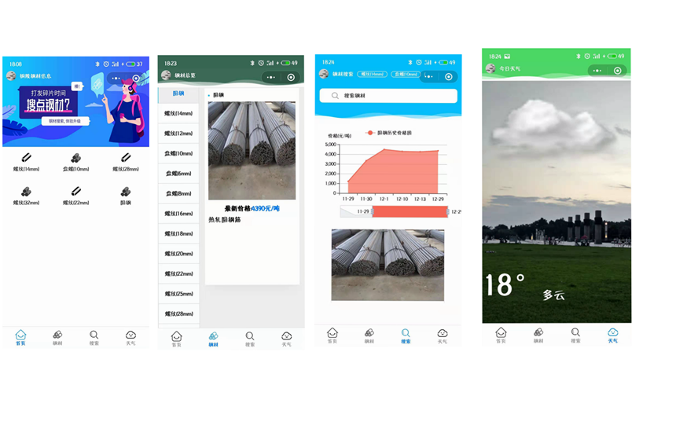
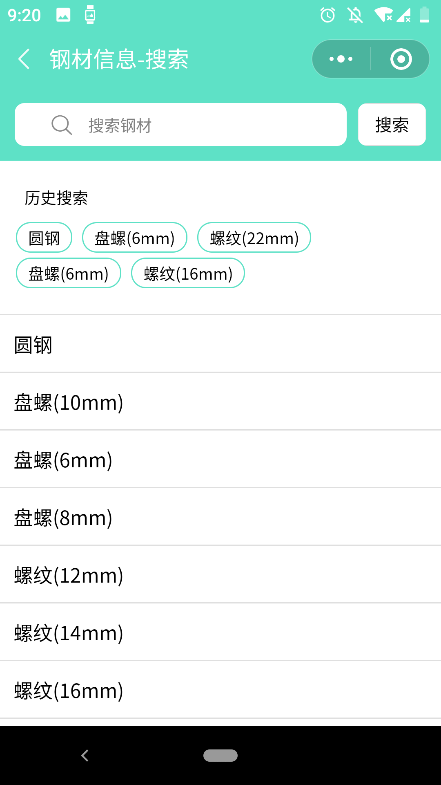
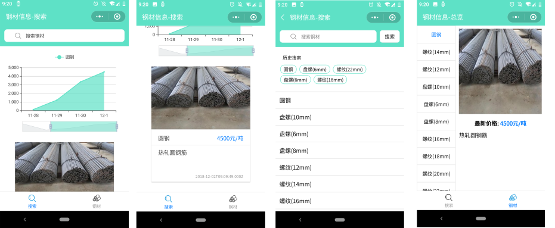
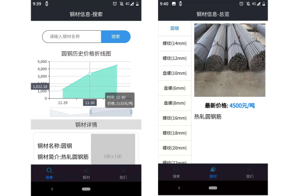
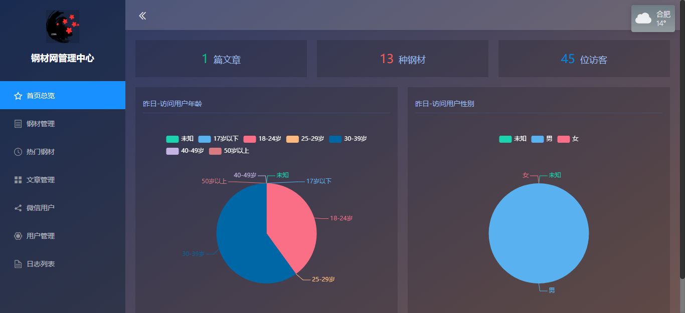

# ironInfoWeapp
钢材信息小程序

# 技术选型


# 使用的第三方库

 - Echarts
 - mpvue-echarts
 - marked (md => html)
 - mpvue-wxparse (html => wxml)

# 目录介绍
```
├─common
├─api // 请求封装
├─components // 组件
│  ├─echarts
│  ├─marked
│  ├─mpvue-echarts
│  └─mpvue-wxparse
├─img // Readme用的图片文件夹
├─pages // 页面
│  ├─article // 文章页
│  ├─auth // 登录页
│  ├─details // 钢材详情页
│  ├─home // 首页
│  ├─index // 钢材搜索页
│  ├─iron // 钢材信息页
│  ├─search // 钢材搜索框
│  └─weather // 天气页
├─static // tabbar图片
└─store // vuex文件
```

# 小程序码


# changelog

 - 18.10.05 项目初始化, 首页插入ECharts图表
 - 18.12.02 项目第一版完成, 功能(搜索钢材, 钢材历史价格图表, 钢材详情)
 - 18.12.08 搜索修改, 添加联想和历史搜索
 - 18.12.19 首页回归, 热门钢材九宫格, 文章列表
 - 18.12.24 对接文章接口
 - 19.01.13 精简文件
 - 19.03.02 热门钢材对接后台配置接口
 - 19.03.03 小程序登录, 新闻资讯
 - 19.03.04 数据添加加载动画
 - 19.03.05 新闻资讯改为天气
 - 19.03.11 UI调整, 顶部显示头像
 - 19.03.12 生日快乐, 搜索页顶部scroll的tab
 - 19.03.22 请求方法封装, 与请求提取
 - 19.05.26 UI修改, 首页热门钢材添加右滑个人关注钢材(采用历史搜索记录)
 - 19.05.27 文章时间改为创建时间, 修复热门钢材swiper高度错误问题, 用户访问小程序计数

# 界面截图

 - 第五版, 钢材计算器, UI调整
---


 - 第四版, UI调整
---

 - 第三版,添加首页
---

 - 第二版, 修改样式和添加联想搜索
---

 - 第一版
---


# 管理后台

